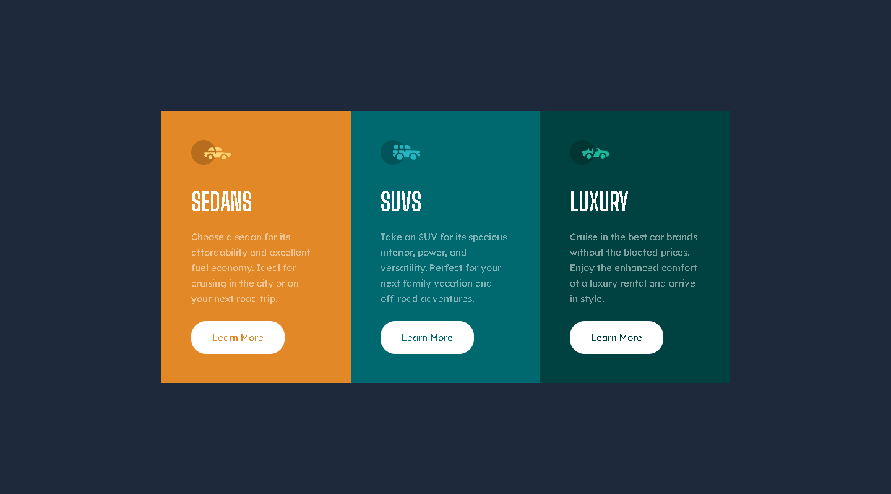

# Frontend Mentor - 3-column preview card component solution

This is a solution to the [3-column preview card component challenge on Frontend Mentor](https://www.frontendmentor.io/challenges/3column-preview-card-component-pH92eAR2-). Frontend Mentor challenges help you improve your coding skills by building realistic projects. 

## Table of contents

- [Frontend Mentor - 3-column preview card component solution](#frontend-mentor---3-column-preview-card-component-solution)
  - [Table of contents](#table-of-contents)
  - [Overview](#overview)
    - [The challenge](#the-challenge)
    - [Screenshot](#screenshot)
    - [Links](#links)
    - [Built with](#built-with)
    - [What I learned](#what-i-learned)
  - [What problem in project](#what-problem-in-project)
  - [Author](#author)

**Note: Delete this note and update the table of contents based on what sections you keep.**

## Overview

### The challenge

Users should be able to:

- View the optimal layout depending on their device's screen size
- See hover states for interactive elements

### Screenshot

### Links

- Live Site URL: [live site URL ](https://dreamy-youtiao-65bbc4.netlify.app/)
- Github URL: [Git](https://github.com/Sittisukintaruk/Frontend-Mentor---3-column-preview-card-component-solution)

### Built with

- Semantic HTML5 markup
- CSS custom properties
- Flexbox
- CSS Grid
- Tailwind
- vite

### What I learned

กลับมาเริ่มทำโปรเจต เป้าหมายคือ 1000 แต้มใน Frontend mentor

## What problem in project

- setup Project

## Author

- Frontend Mentor - [@Sitthisak Intharak](https://www.frontendmentor.io/profile/Sittisukintaruk)